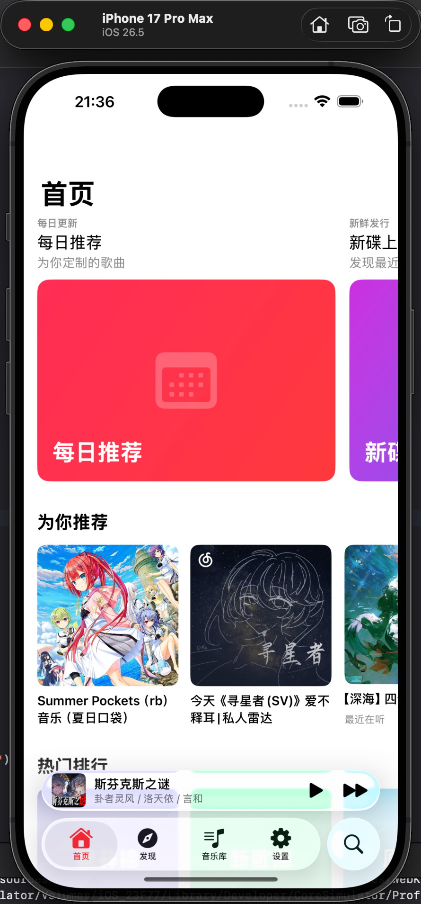
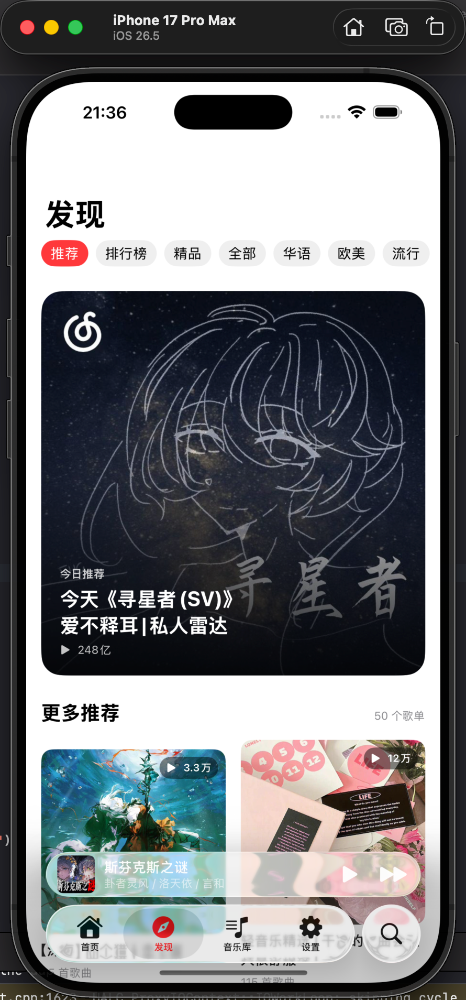
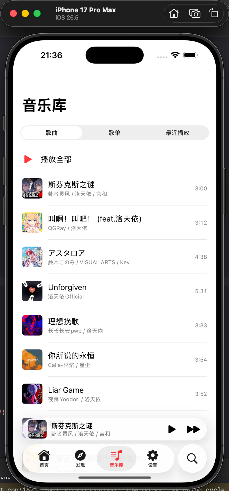
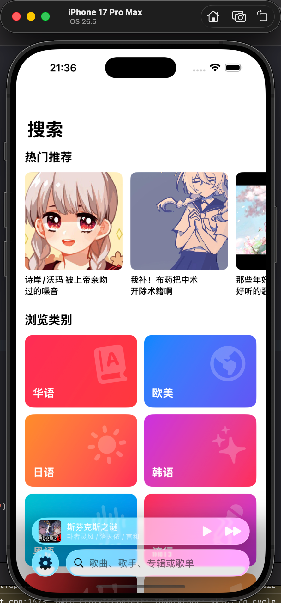
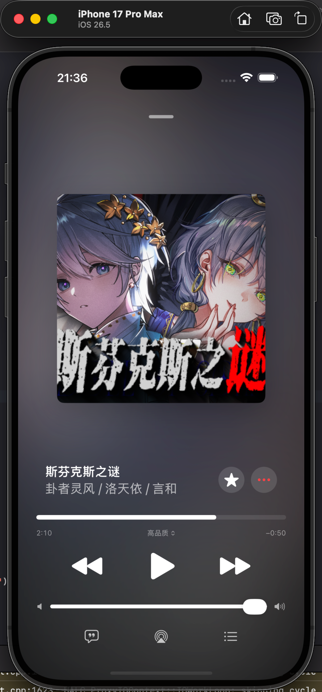
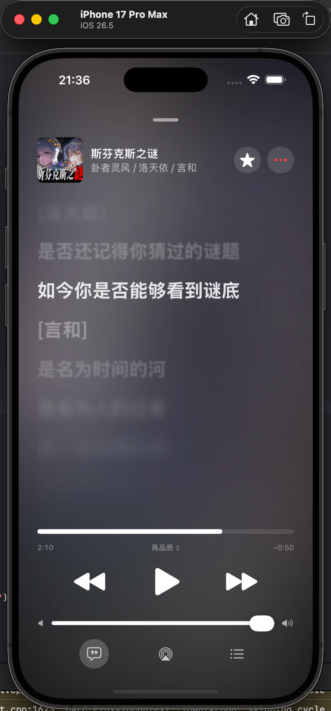
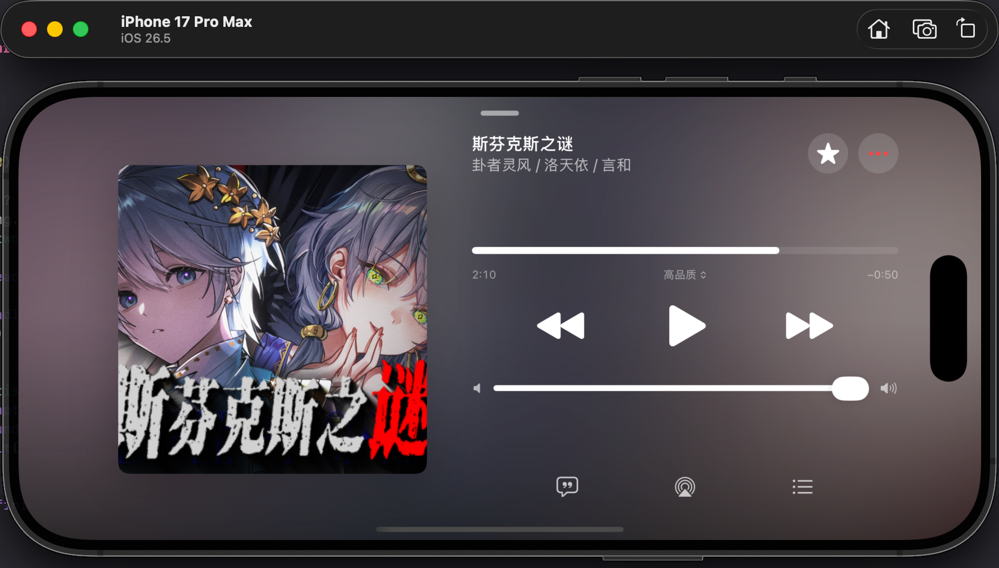
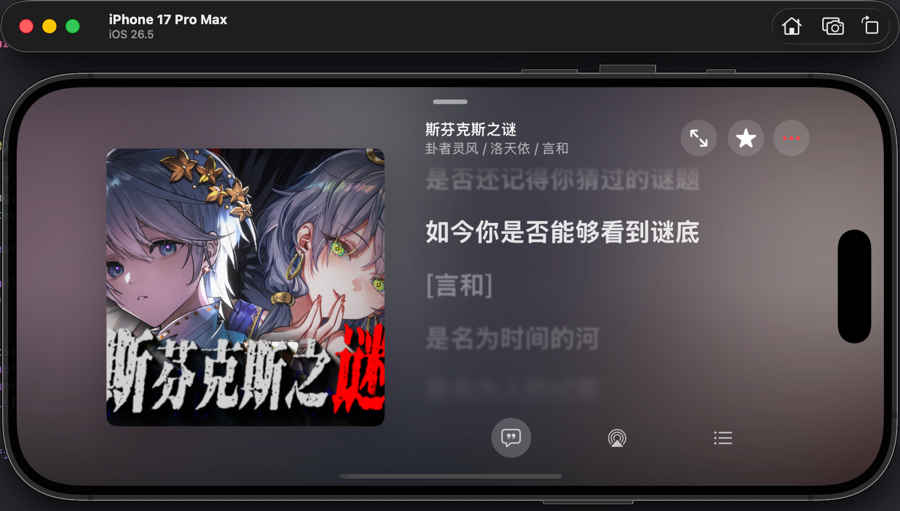
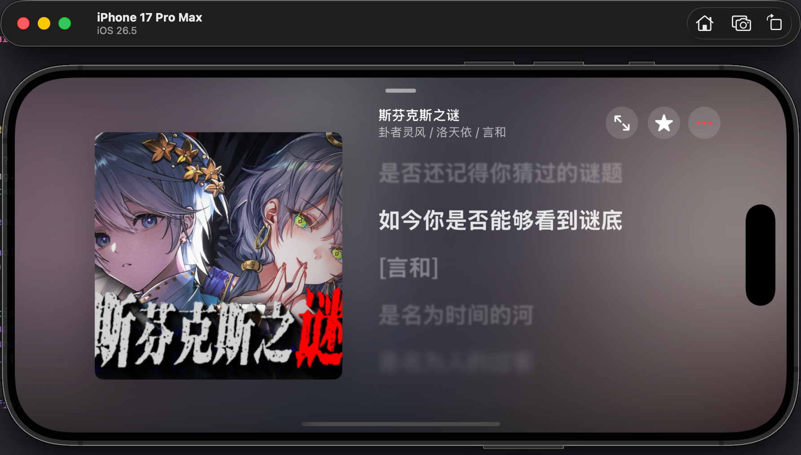
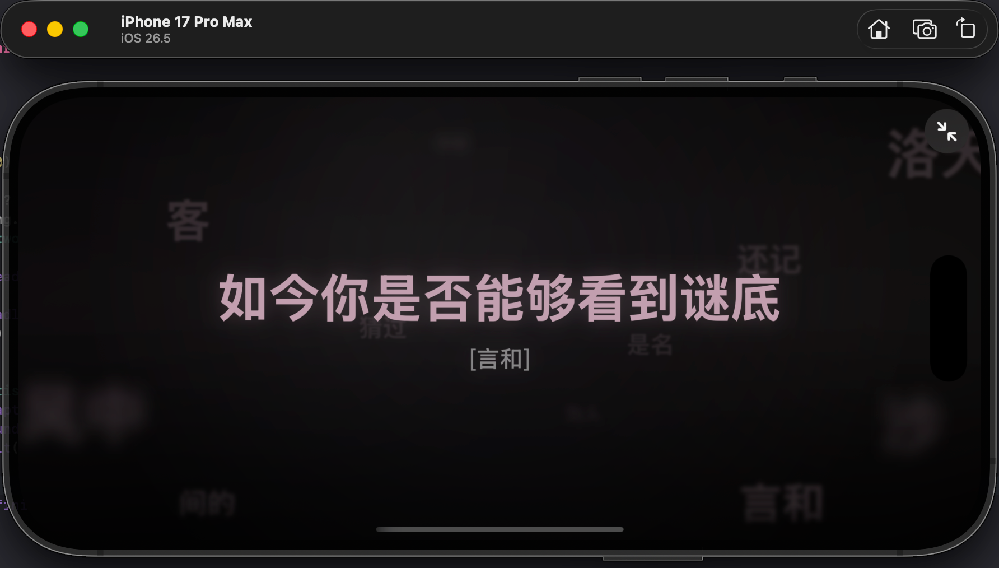

# MeloX

[](https://github.com/youshen2/MeloX/blob/master/LICENSE)
[](https://github.com/youshen2/MeloX/releases)
[](https://github.com/youshen2/MeloX/stargazers)

<p align="center">
  使用原生 SwiftUI 构建的第三方网易云音乐播放器
</p>

[](https://t.me/@melox_official)

> MeloX 是非官方开源项目，与网易云音乐及其关联公司不存在隶属、合作或授权关系。项目仍在开发中，接口和功能可能随网易云音乐服务变化而失效。

## 应用截图

### 基础页面

<p align="center">
  
  
  
  <br>
  
</p>

### 播放器

<p align="center">
  
  
</p>

### 横屏播放器

<p align="center">
  
  
  
</p>

### [特色功能]全屏天际歌词

来自小米yu7天际屏的灵感。

<p align="center">
  
</p>

## 功能

- 首页内容：编辑推荐、每日推荐、推荐歌单、热门排行、新碟上架和热门歌手。
- 内容浏览：查看歌单、专辑、歌手详情，并按分类发现歌单。
- 聚合搜索：搜索歌曲、专辑、歌手和歌单。
- 网易云账号：通过官方网页完成登录，读取收藏歌曲、收藏歌单和最近播放记录。
- 音乐库操作：收藏或取消收藏歌曲与歌单，将歌曲添加到自己创建的歌单。
- 完整播放器：播放队列、随机播放、列表循环、单曲循环、进度与音量控制。
- 后台播放：支持锁屏播放信息、系统媒体控制、耳机与音频路由变化处理。
- 播放状态恢复：保存当前歌曲、队列、播放位置、循环模式和随机顺序。
- 多档音质：标准、高品质和无损音质；实际可用性取决于账号权限与曲目版权。
- 歌词体验：支持 LRC、YRC 逐字歌词、翻译歌词、伪逐字进度、光效和歌词跳转。
- 横屏天际歌词：提供可调节的当前歌词、后续歌词和环境文字动态效果。
- 原生界面：适配 iPhone 与 iPad，并为播放器提供横竖屏布局。

## 运行环境

- Xcode 26.6 或更高版本
- iOS / iPadOS 26.5 或更高版本
- Swift 5
- 用真机运行时，需要可用于代码签名的 Apple Developer 账号

## 本地构建

1. 克隆仓库：

   ```bash
   git clone https://github.com/youshen2/MeloX.git MeloX
   cd MeloX
   ```

2. 使用 Xcode 打开项目：

   ```bash
   open MeloX.xcodeproj
   ```

3. 选择 `MeloX` Target，在 Signing & Capabilities 中设置自己的开发团队；如有需要，同时更换为唯一的 Bundle Identifier。

4. 选择兼容的 iPhone、iPad 或模拟器，然后构建运行。

无需部署额外的后端服务，也无需配置第三方 API 地址。

## 项目结构

```text
MeloX/
├── App/                  # 页面路由与应用级导航
├── Core/
│   ├── Artwork/          # 封面颜色与视觉数据
│   ├── Library/          # 账号音乐库状态与收藏操作
│   ├── Lyrics/           # LRC / YRC 模型和解析
│   ├── Models/           # 业务模型与接口响应
│   ├── Networking/       # 网易云接口与直接请求客户端
│   ├── Persistence/      # 本地持久化支持
│   ├── Playback/         # 播放引擎、队列和系统媒体会话
│   └── Settings/         # 应用与播放器偏好
├── Features/             # 首页、发现、搜索、音乐库、播放器等功能页面
├── Shared/               # 跨功能复用的 SwiftUI 视图
├── Assets.xcassets/      # 应用图标、强调色与图片资源
└── MeloXApp.swift        # 应用入口与依赖装配
```

## 已知限制

- 网易云音乐未公开保证这些接口长期稳定，服务端变更可能导致部分功能不可用。
- 试听、完整播放、音质和地区可用性取决于网易云音乐账号、版权与服务端策略。
- MeloX 不以绕过付费、版权或地区限制为目标。
- 当前仓库没有自动化测试 Target，重要播放和账号流程需要在合适的设备环境中验证。

## 特别鸣谢

- [jayfunc/BetterLyrics](https://github.com/jayfunc/BetterLyrics)：逐字歌词渲染、光效与动效参考。
- [WXRIW/Lyricify-Lyrics-Helper](https://github.com/WXRIW/Lyricify-Lyrics-Helper)：网易云 YRC 逐字歌词解析参考。
- [qier222/YesPlayMusic](https://github.com/qier222/YesPlayMusic)：网易云接口与播放器实现参考。

这些项目的代码与资源仍分别受其原始许可证约束。

## 许可证

MeloX 以 [GNU General Public License version 3](LICENSE) 发布。复制、修改或分发本项目时，请遵守许可证中的源代码提供、版权声明和同许可证分发等要求；具体条款以 `LICENSE` 文件为准。

## 免责声明

本项目出于学习与研究目的开发，但不额外限制 GPL 授予的使用权利。使用者应自行遵守所在地法律法规、网易云音乐服务条款以及音乐内容的版权要求。项目按许可证所述不提供担保；因使用本项目产生的风险由使用者自行承担。
